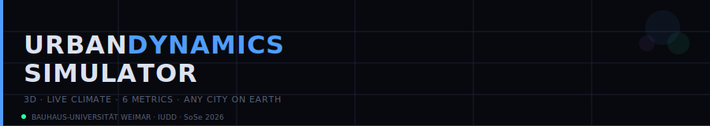
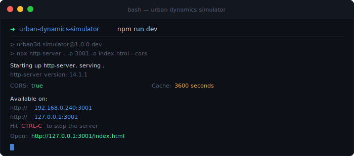

<div align="center">

<picture>
  <source media="(prefers-color-scheme: dark)" srcset="docs/banner-dark.svg">
  <source media="(prefers-color-scheme: light)" srcset="docs/banner-light.svg">
  
</picture>

**A live-weather 3D city tool that scores walkability, heat-island risk, air quality, solar access, noise, and pedestrian comfort — in any browser, for any city on Earth.**

<br>

[](https://architron2020-dev.github.io/Urban-Dynamic-Simulator/)
[](https://github.com/architron2020-dev/Urban-Dynamic-Simulator)
[](https://threejs.org/)
[](https://open-meteo.com/)
[](LICENSE)

</div>

---

## Author & course

**Author:** Parthasarathy 
**Studio:** Prompt City — Urban Vision Wolfsburg 2026
**Course:** IUDD Master, SoSe 2026
**Chair:** Informatics in Architecture and Urbanism (InfAU), Faculty of Architecture and Urbanism, Bauhaus-Universität Weimar
**Teaching staff:** Reinhard König, Martin Bielik, Sven Schneider, Egor Gaydukov, Egor Gavrilov
**Exercise:** Urban Absurdities (Nonsense Project)
**Submission date:** 2026-04-16

---

## Links

**Live app (GitHub Pages):** [architron2020-dev.github.io/Urban-Dynamic-Simulator](https://architron2020-dev.github.io/Urban-Dynamic-Simulator/)
**Source repo:** [github.com/architron2020-dev/Urban-Dynamic-Simulator](https://github.com/architron2020-dev/Urban-Dynamic-Simulator)
**Miro frame:** [miro.com/app/board/uXjVGCtKivA=](https://miro.com/app/board/uXjVGCtKivA=/?moveToWidget=[your-frame-id])
**60 s showreel:** Embedded on the Miro frame above

---

## The task

The **Nonsense Project** is a two-week sprint designed to get familiar with the application of coding agents in building apps, tools, and projects that investigate unique ways of working with urban context. I was randomly assigned one urban paradox and one constraint from the studio's Nonsense Ideas deck and built a working web app that answers this combination. The process is documented here and in a 60-second showreel.

---

## Theme & constraint

> **Theme (Urban Absurdity):**
> *[Paste the theme exactly as drawn from the Nonsense Ideas deck.]*

> **Constraint (Playful Limitation):**
> *[Paste the constraint exactly as drawn from the Nonsense Ideas deck.]*

---

## Concept and User Story

### Concept

The Urban Dynamics Simulator is a live, browser-based 3D urban analysis environment. It renders a procedural city block, pulls real-time weather data from any location on Earth via Open-Meteo, and continuously recalculates six environmental performance metrics: walkability, thermal stress, air quality index, solar access, noise level, and pedestrian comfort.

The core design paradox is **dynamic unpredictability**: the same street corner feels radically different at 07:00 on a rainy Berlin morning versus a dry midday in Dubai. Rather than a fixed simulation, every parameter — traffic density, building height, weather, time of day — can be overridden or driven by live data. Six urban intervention scenarios (elevated flyover, BRT lane, green buffer, metro, high-rise, base fabric) physically modify the 3D model and update all scores in real time, making the trade-offs between mobility, comfort, and environmental quality immediately visible. The constraint bites precisely here: you can change everything, but the city never stops moving.

### User story

**Amara, 29, urban planning intern, City of Wolfsburg.**

It is a Wednesday afternoon. Amara's team is preparing a brief on a proposed bus rapid transit (BRT) corridor through the industrial fringe. Her supervisor asks for a quick environmental impact snapshot before the 16:00 call — noise, air quality, walkability. Amara doesn't have time to open QGIS.

She opens the simulator from her bookmarks on a second monitor. The 3D city loads in seconds. She types *Wolfsburg* in the location bar and hits Go — the top bar updates to 11°C, overcast, 8 km/h wind; rain streaks begin drifting across the viewport.

She switches the scenario to **BRT** and watches a green lane appear along the road centreline, a white bus mesh sliding into position. The scores panel updates instantly: walkability climbs from 47 to 61, air quality index drops, noise edges down. She toggles the **Traffic flow** and **Noise rings** layers. The concentric red noise rings shrink visibly compared to the base scenario.

She presses **Analyse ↗** — a prompt is assembled from the live state and copied to her clipboard. She pastes it into the team's AI chat. Thirty seconds later she has three sentences to add to the brief.

Amara feels vaguely amused that she reached a defensible environmental recommendation faster than it would have taken to open a GIS file. She also notices the heat island score barely moves regardless of the BRT — she hadn't considered that. She adds a line about green buffer pairing.

---

## How to use it

**1. Open the live app** — the 3D city loads automatically in the browser viewport. The left panel shows controls; the right panel shows scores and insights.

**2. Set a location** — type any city name (e.g. `Wolfsburg`, `Berlin`, `Dubai`) in the location bar and click **Fetch**. Live temperature, humidity, wind, weather code, and UV index are fetched and applied to the 3D scene within seconds. Rain, snow, or fog appear on the canvas overlay automatically. Alternatively click **Use GPS** to use your device's position.

**3. Pick a scenario** — click one of the ten scenario buttons (Base · Flyover · BRT · Metro · Green buffer · High-rise · Street market · Cycle track · Public plaza · Pedestrian zone). 3D geometry is added to or removed from the city group; scores update immediately.

**4. Adjust the sliders** — drag Traffic density, Building floors, Temperature, Humidity, Wind, and Time of day. Floors rebuilds the city geometry; Time shifts the sun position and lighting colour. All changes update scores live.

**5. Toggle analysis layers** — switch on Traffic flow, Heat island, Isovist field, Daylight/shadow, Air quality, Space syntax, Noise rings, or Accessibility. Layers can be stacked to reveal compound effects (e.g. Traffic + Noise to evaluate a BRT lane).

**6. Use the Compare tab** — capture a Snap A in one scenario, switch to another, capture Snap B. A side-by-side score diff is displayed automatically.

**7. Press Analyse ↗** — assembles a full-state prompt (location, weather, traffic, scores, active layers) and copies it to clipboard. Paste into any LLM chat for detailed urban design recommendations.

**8. Toggle light / dark mode** — click the 🌙 / ☀️ pill switch in the top bar to switch between the default dark UI and a high-contrast light theme.

> **Tip:** run the same location in Base vs. Green buffer at peak traffic (slider 80%+) and 35°C — the heat island score gap becomes dramatic. Then stack Heat island + Air quality layers to see spatial overlap.

---

## Technical implementation

**Frontend:** Vanilla JavaScript + HTML5 Canvas, single-file, no build step required.

**3D rendering:** Three.js r128 loaded from CDN. Scene uses ambient, hemisphere, and directional (sun) lights with PCFSoft shadow maps at 2048×2048. Camera is a perspective orbit with smooth lerp.

**Hosting & build:** GitHub Pages, deployed automatically via GitHub Actions workflow at `.github/workflows/deploy.yml` on every push to `main`.

**Weather data:** Open-Meteo Forecast API — fetches current temperature, humidity, wind speed, weather code, UV index, visibility, and precipitation. Free, no API key required.

**Geocoding:** Open-Meteo Geocoding API converts any location name to latitude/longitude before the weather fetch.

**GPS:** Browser Geolocation API used as an alternative to manual location input.

**Models at runtime:** None client-side. The Analyse ↗ button assembles a prompt that is passed to an external LLM.

**Notable libraries:** Three.js r128, Google Fonts (DM Mono, Syne).

**Run locally:**

```bash
npm run dev
```

<picture>
  <source media="(prefers-color-scheme: dark)" srcset="docs/local-run-dark.svg">
  <source media="(prefers-color-scheme: light)" srcset="docs/local-run-light.svg">
  
</picture>

The server opens `index.html` automatically at `http://127.0.0.1:3001`. No install or build step needed — the app is a single HTML file.

---

## Working with AI

**Coding agent:** Claude Code — Model `claude-sonnet-4-6`

### Key prompts that moved the project

> *"Build a single-file browser app using Three.js r128 that renders a procedural 3D city with ambient, hemisphere, and directional (sun) lights, shadow maps, and an orbit camera. Include a left control panel, a right score panel, and a bottom metrics bar. No build step."*

> *"Add real-time weather integration via the Open-Meteo API. Fetch current temperature, humidity, wind speed, weather code, UV index, and visibility for any location by name using the geocoding endpoint. Sync the fetched values to the manual sliders and update fog density, fog colour, and sun intensity based on WMO weather codes."*

> *"Add an animated HTML5 Canvas overlay for weather effects: 200 rain streaks with velocity and reset logic, 120 drifting snow particles with horizontal wobble, a semi-transparent grey fill for fog, and a random lightning bolt flash for thunderstorm codes. Make it pointer-events: none."*

> *"Add a scenario comparison system: two snapshot capture buttons (A / B) that record current scores and scenario label, and a side-by-side score diff rendered in a Compare tab on the right panel."*

> *"Add a light / dark mode pill toggle to the topbar. CSS variables on :root drive all colours; toggling a .light class on the document element switches the full palette including Three.js fog colour and renderer clear colour."*

### Reflection

The agent was most effective when given explicit architectural constraints upfront — single-file, no build, specific Three.js version. Scaffold-then-refine worked better than trying to generate the full app in one shot: building the 3D scene first, then the weather layer, then each scenario, kept each iteration legible and reviewable. The agent occasionally drifted toward adding abstractions or helper classes that weren't asked for; redirecting with "keep it in one script block" resolved this quickly. One thing to do differently next time: define the score formula in the very first prompt. It affects almost every other system and retrofitting it after three iterations of placeholder values was the most expensive rework step in the whole project.

---

## Screenshots

> Replace the placeholder paths below with real screenshots. Drop `docs/screenshot-dark.png` and `docs/screenshot-light.png` into the repo and GitHub will serve the right one based on the viewer's colour scheme.

<picture>
  <source media="(prefers-color-scheme: dark)" srcset="docs/screenshot-dark.png">
  <source media="(prefers-color-scheme: light)" srcset="docs/screenshot-light.png">
  
</picture>

---

## Score reference

A score above 75 means excellent conditions — full pedestrian comfort, clean air, unobstructed solar access, or low noise depending on the metric. Scores between 50 and 75 are acceptable but benefit from targeted interventions such as shade canopies, acoustic barriers, or modal shift. Scores between 25 and 50 indicate poor performance where structural urban design changes are needed. Below 25, conditions are hostile: dangerous heat stress, hazardous air quality, near-zero solar access, or a street environment that actively discourages walking.

Higher is better for walkability, solar access, and pedestrian comfort. Higher is worse for thermal stress, air quality index, and noise level.

---

## Credits, assets, licenses

**Fonts:** DM Mono and Syne via Google Fonts — SIL Open Font License.

**Weather & geocoding data:** [Open-Meteo](https://open-meteo.com/) — open-source, CC BY 4.0.

**3D engine:** [Three.js r128](https://threejs.org/) — MIT licence.

**Urban analysis references:** Space syntax theory (Hillier & Hanson), isovist analysis (Benedikt), UTCI thermal comfort index, WHO air quality guidelines — academic / public domain.

**This repo:** MIT licence.

---

<div align="center">

*Built with [Claude Code](https://claude.com/claude-code) · Bauhaus-Universität Weimar · SoSe 2026*

</div>
